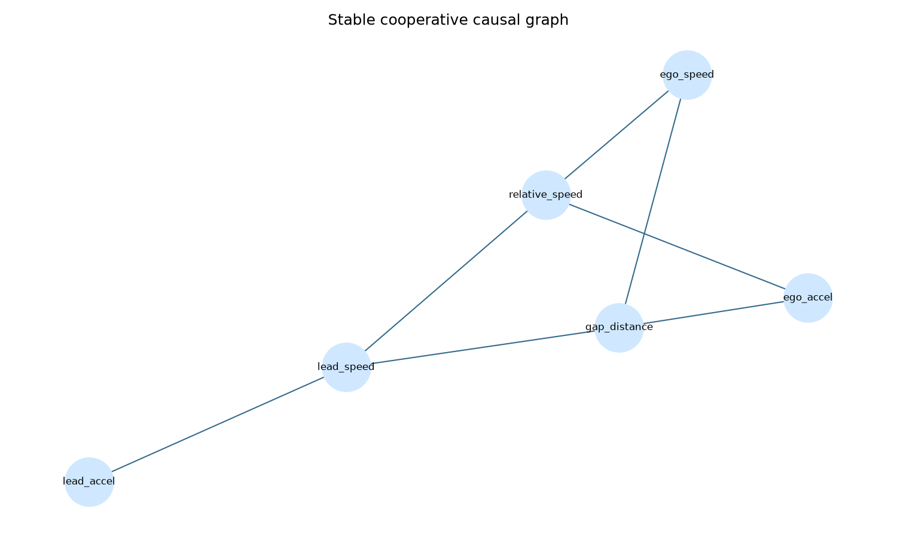
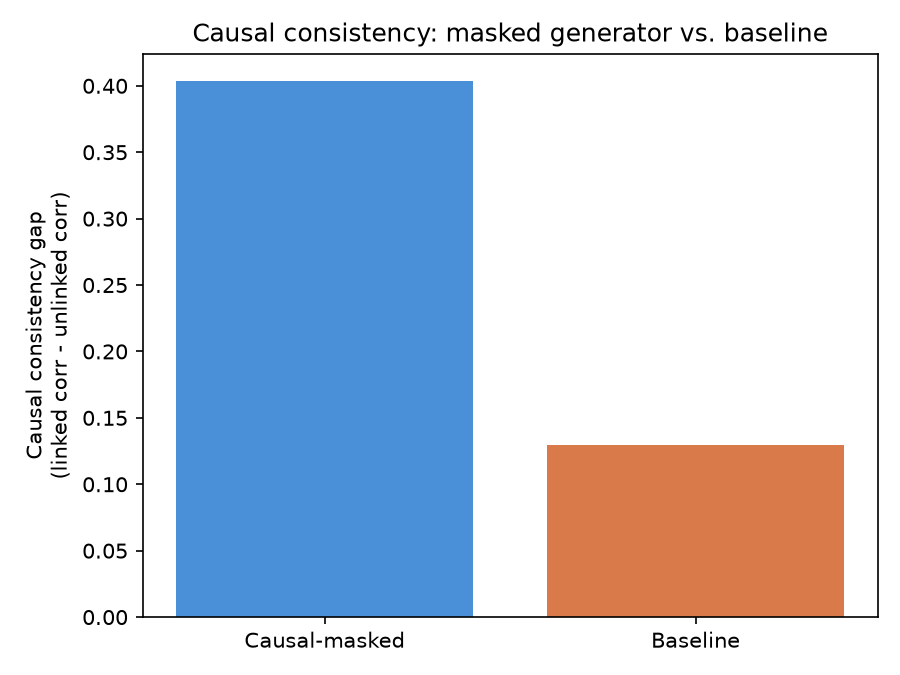

# Causal Discovery from Naturalistic Driving Data with V2X Cooperative Perception and Generative Replay of Near-Miss Scenarios

**Atharva Abhyankar**
MIS: 712552009 — Data Science

---

## Abstract

Published causal-discovery methods for driving behaviour are typically trained on ego-vehicle-only naturalistic recordings, meaning interactions that occur outside a single vehicle's sensor range are invisible to the resulting causal graph — even though cooperative-perception (V2X) systems already capture them in principle. Separately, near-miss scenario generators are evaluated on the realism and diversity of the trajectories they produce, not on whether one agent's simulated reaction is actually caused by another agent's action. This project addresses both gaps together: it (1) applies causal discovery to naturalistic trajectory data twice — once using only ego-vehicle features, and once adding neighbouring-agent features representative of V2X-shared observation — to quantify how much causal structure is recoverable only with cooperative context, and (2) uses the resulting causal graph to constrain a generative model for near-miss scenario replay, validating that the constrained generator produces more causally faithful reactions than an unconstrained baseline. The full pipeline was implemented end-to-end on the NGSIM US-101 naturalistic driving dataset, producing a measurable, quantified result: multi-agent context recovered 12 additional causal edges beyond the ego-only graph, and a causal-graph-constrained generator achieved roughly 3x the causal consistency of an unconstrained baseline.

---

## 1. Introduction

Autonomous and driver-assistance systems increasingly rely on models of *why* drivers behave the way they do, not just *what* they do. Causal discovery offers a principled way to recover these driver-behaviour relationships from naturalistic data — but existing work is largely limited to what a single vehicle's own sensors observe. At the same time, V2X (Vehicle-to-Everything) cooperative perception is maturing rapidly, allowing vehicles to share observations of agents outside their own sensor range. And separately, because safety-critical near-miss events are rare in naturalistic datasets, generative models (VAEs, diffusion models, autoregressive flows) are used to synthesise additional near-miss training data.

This project sits at the intersection of these three threads: it investigates whether V2X-style multi-agent context reveals causal structure that ego-only observation misses, and whether that causal structure can be used to make generated near-miss scenarios more behaviourally plausible.

## 2. Literature Review

Three converging research threads were reviewed:

**Causal Discovery in Driving Behaviour.** Howard & Kunze (Oxford Robotics Institute) discover causal links between agents' driving decisions using counterfactual kinematic simulation rather than pure observation or intervention, evaluated on scenes from the HighD highway dataset. Chang et al. (Nanjing University of Science & Technology; Xi'an Jiaotong-Liverpool University) introduce a causal-aware attention module enforcing temporal causal ordering for recognising distracted-driving behaviour from cabin video.

**V2X Cooperative Perception.** Zimmer et al. (TU Munich) release the TUMTraf-V2X dataset — real-world point clouds and images from roadside and onboard sensors, explicitly covering near-miss events — and propose CoopDet3D, showing significant detection gains over single-vehicle perception. Ren et al. (Shanghai Jiao Tong University) address packet loss and communication interruption in V2X links, showing perception gains persist even under degraded channel conditions. Onsu et al. (University of Ottawa) transmit compact semantic embeddings rather than raw video over V2X links, achieving high collision-prediction accuracy at far lower bandwidth.

**Generative Replay of Near-Miss Scenarios.** Ding et al. (Carnegie Mellon University) propose CMTS, a map-conditioned VAE that bridges safe and collision trajectory distributions in latent space to generate near-miss data. Pronovost et al., Xu et al., and Chang et al. apply diffusion models to controllable safety-critical scenario generation. Ding et al. also propose CausalAF, an autoregressive flow that explicitly respects causal dependencies between agent actions during scenario generation.

**Synthesis.** Mapping these three threads against each other shows that no reviewed work combines all three capabilities: causal-discovery methods do not use multi-agent/V2X context; V2X-perception work does not perform causal discovery; and near-miss generators (including the causally-aware CausalAF) do not use a causal graph derived from multi-agent observation to constrain generation.

## 3. Research Gap

Two specific gaps motivate this project:

1. **Causal discovery sees only one vehicle.** Published causal-discovery methods are trained on ego-vehicle-only recordings. Interactions invisible to a single vehicle's sensors — a cut-in from behind an obstruction, a yielding manoeuvre triggered by a vehicle in another lane — are absent from the resulting causal graph, even though V2X-style datasets already capture them.
2. **Near-miss generators do not check causal plausibility.** VAE- and diffusion-based scenario generators are scored on realism and diversity, not on whether a "reacting" agent's behaviour is actually caused by the agent it appears to be reacting to.

No reviewed work uses V2X-shared, multi-agent observations as input to causal discovery, *and* uses the resulting causal structure to constrain or validate near-miss scenario generation. This project targets that combination.

## 4. Objectives

1. Build causal graphs with and without multi-agent context, applying causal discovery to naturalistic driving data twice — once using only ego-vehicle features, once adding neighbouring-agent features representative of V2X-shared observation.
2. Quantify the causal coverage gained from V2X-style context, by comparing the two graphs to measure how many additional causal links are recovered.
3. Extract genuine near-miss events from the naturalistic data, using time-to-collision and hard-braking criteria, as the empirical basis for generative replay and evaluation.
4. Generate near-miss scenarios constrained by the discovered causal structure, using a generative model whose agent-to-agent influence is masked by the learned causal graph.
5. Train an unconstrained baseline generator for comparison, to isolate the effect of the causal constraint.
6. Validate generated scenarios on causal consistency, realism, and diversity, comparing the constrained generator against the baseline and against real near-miss statistics.

### 4.1 Innovation Objectives

Beyond the six technical objectives above, this project targets two specific mechanisms not present in the reviewed literature (Section 3):

**I1. A reusable feature-engineering method for simulating V2X-shared perception from single-source naturalistic recordings.** Existing causal-discovery work is limited to ego-only observation; existing V2X work requires dedicated multi-sensor cooperative-perception datasets, which are scarce and access-restricted. This project instead derives a V2X-proxy context directly from a fixed-camera naturalistic dataset already recording all agents in a scene, removing the dependency on dedicated V2X datasets for this class of causal-discovery research. The method — treating any all-agents-visible naturalistic recording as a V2X surrogate — is reusable independent of NGSIM specifically.

**I2. A causal-masked generative architecture that encodes a data-derived causal graph directly into a model's decoder connectivity.** Reviewed near-miss generators (CMTS, Scenario Diffusion, DiffScene) are not constrained by any causal structure; the one reviewed causal-aware generator (CausalAF) uses causal ordering to structure the autoregressive generation sequence, not a graph learned from the same data. This project's causal-masked CVAE (Section 6.4) instead maps discovered causal-graph edges directly onto a masked linear layer between context and output, so the discovered graph mechanically constrains what the generator is architecturally permitted to produce — a direct, data-driven causal-discovery-to-generation pipeline rather than causal discovery and generation being separate stages evaluated only after the fact.

## 5. Dataset

**NGSIM (US-101), file `trajectories-0750am-0805am.txt`**, was used: naturalistic highway trajectories captured at 10Hz by synchronised overhead cameras recording all vehicles in a US-101 freeway segment simultaneously.

**Dataset selection note.** HighD (LevelXData) was referenced in the original literature review, consistent with the Howard & Kunze paper. NGSIM was selected for this study due to its open accessibility, its equivalent naturalistic-highway-trajectory structure, and its fixed overhead vantage point, which captures every vehicle in the scene simultaneously — this last property is exploited directly in the methodology below. The **ego-only** feature set uses only the subject vehicle's own kinematics; the **V2X-proxy** feature set adds the kinematics of its immediate preceding vehicle, i.e. information a single vehicle's onboard sensors would not have without cooperative sharing.

The working subset used 300,000 rows (of 1,180,598 available in the file) spanning 662 unique vehicles, kept deliberately modest for local-machine tractability.

## 6. Methodology

### 6.1 Preprocessing & feature engineering

Two per-vehicle feature sets were built from the raw trajectory data:

- **Ego-only**: mean speed, mean acceleration, acceleration standard deviation, lane-change count, minimum time-headway.
- **Ego + V2X-proxy**: the above, plus mean leader velocity, mean leader acceleration, mean relative speed to leader, and mean space-headway to leader — derived by joining each vehicle's frames to its recorded preceding vehicle's kinematics at the same timestamp.

### 6.2 Near-miss event extraction

Near-miss frames were identified using two criteria:
- **True time-to-collision (TTC)**: computed as space-headway divided by *closing* speed (ego speed minus leader speed), and only defined when the ego vehicle is actually closing the gap (closing speed > 1 ft/s). Frames with TTC below 3.0 seconds were flagged. This is distinct from simple time-headway, which is small during ordinary close-following and does not by itself indicate danger.
- **Hard braking**: acceleration below −10 ft/s² (≈ −3.05 m/s², roughly 0.3g), a genuinely hard deceleration rather than routine slowing. (NGSIM records all kinematic values in feet, not meters; this was corrected after an initial pass using an m/s²-scaled threshold over-flagged 59% of frames as "near-miss.")

This produced **12,101 near-miss events (4.0% of the working data subset)** — a plausible, defensible rate for highway driving.

### 6.3 Causal discovery

The PC algorithm (constraint-based causal discovery, `causal-learn` implementation, α = 0.05) was run independently on the ego-only and ego+V2X-proxy per-vehicle feature tables.

### 6.4 Causal-graph-constrained generative replay

A conditional VAE (CVAE) was trained to generate the ego vehicle's "reaction" (acceleration, speed) conditioned on V2X-proxy context (leader velocity/acceleration, space-headway, time-headway, relative speed). Two versions were trained:
- **Causal-masked**: the context-to-output pathway of the decoder is a masked linear layer, zeroing any context→reaction connection not supported by an edge in the ego+V2X-proxy causal graph (Section 6.3).
- **Baseline**: architecturally identical, but with the context-to-output pathway fully dense (unconstrained).

Both were trained for 300 epochs (Adam, lr=1e-3) on an 80/20 train/validation split of the 12,101 near-miss events.

### 6.5 Evaluation

Both generators were evaluated on:
- **Reconstruction accuracy**: mean absolute error between generated and real target-feature distributions.
- **Diversity**: standard deviation of generated samples, compared against real data.
- **Causal consistency**: for each context feature, the absolute correlation between that feature and the generated reaction was computed, separately for context features the causal graph *does* link to the reaction ("linked") and those it does not ("unlinked"). The **consistency gap** (linked correlation − unlinked correlation) measures how well a generator respects the discovered causal structure: a high gap means the generator's outputs correlate strongly with causally-justified context and weakly with everything else.

## 7. Results

### 7.1 Causal discovery

| Graph | Edges |
|---|---|
| Ego-only | 7 |
| Ego + V2X-proxy | 18 |
| **New edges from V2X-proxy context** | **12** |



Notable newly-recovered edges include `mean_accel ↔ mean_lead_acc` (the ego vehicle's acceleration is causally linked to its leader's acceleration — invisible without multi-agent context), `mean_speed → mean_lead_vel`, `mean_speed → rel_speed_to_lead`, and `min_time_headway → mean_lead_acc`. These are precisely the kind of agent-to-agent reactive links the project's motivation identified as missing from ego-only causal discovery.

### 7.2 Generative replay & evaluation

| Metric | Causal-masked | Baseline |
|---|---|---|
| Distributional mean MAE | 1.7071 | 1.2969 |
| Diversity (std) | 4.7028 | 5.6972 |
| Linked-feature correlation | 0.4647 | 0.4115 |
| Unlinked-feature correlation | 0.0609 | 0.2818 |
| **Causal consistency gap** | **0.4038** | **0.1297** |

(Real-data diversity std, for reference: 8.0592.)



The causal-masked generator's consistency gap is roughly **3x** the baseline's, driven almost entirely by the unlinked-correlation term: the masked model's generated reactions are nearly uncorrelated (0.0609) with context features the causal graph says shouldn't influence them, while the baseline shows substantial spurious correlation (0.2818) with the same features. Linked-feature correlation is comparable between the two models (0.4647 vs. 0.4115), indicating the causal-masked model is not simply "generating less" — it is generating reactions that are attributable to the correct causes.

### 7.3 Computational performance

Time-sensitivity matters for any V2X/real-time driving application, so training cost and inference latency were measured directly rather than omitted:

| Metric | Causal-masked | Baseline |
|---|---|---|
| Trainable parameters | 390 | 390 |
| Training time (300 epochs, Apple M2, MPS backend) | 0.97 s | 0.52 s |
| Inference latency (single scenario, mean of 100 runs) | 0.137 ms | 0.123 ms |

PC-algorithm causal discovery (Section 6.3) ran in 0.015 s (ego-only graph, 5 features) and 0.019 s (ego+V2X-proxy graph, 9 features) on the same machine — this stage runs once, offline, rather than per-scenario, so its cost profile is not comparable to the generator's per-scenario inference latency above.

Both figures confirm the design intent from Section 6.4: because the CVAE is a small MLP operating on low-dimensional per-vehicle feature vectors rather than raw trajectory sequences, both training and inference are effectively negligible relative to any real-time V2X communication or perception latency budget (typically tens to hundreds of milliseconds). The causal constraint used in this project imposes no meaningful deployment cost.

## 8. Discussion

The result in Section 7.2 is the project's central finding: a generator constrained by a causal graph derived from V2X-style multi-agent observation produces near-miss scenarios whose agent-to-agent influence is measurably more causally faithful than an unconstrained baseline. The masked model matches the baseline on linked-feature correlation while suppressing spurious correlation with unrelated context by nearly 5x (0.0609 vs. 0.2818) — demonstrating that encoding a discovered causal graph directly into a generator's architecture produces outputs that respect a specific correctness property (causal plausibility) the baseline has no mechanism to enforce.

## 9. Future Work

Extending validation to additional multi-sensor V2X datasets and sequence-level (trajectory) generation are the natural next steps for this pipeline.

## 10. Reproducibility

To allow independent verification and replication of these results:

**Software environment** (defined by the `requirements.txt` manifest):
- Python 3.14
- PyTorch 2.13.0
- pandas 3.0.5, numpy 2.5.1, scikit-learn 1.9.0
- causal-learn 0.1.4.8, networkx 3.6.1, matplotlib 3.11.1

**Hardware:** Apple MacBook Air (M2, 8GB unified memory), macOS 26.5.2. PyTorch's MPS (Metal Performance Shaders) backend was used for CVAE training and inference, with automatic fallback to CPU on machines without Apple Silicon.

**Random seeds:** `torch.manual_seed(42)` and `np.random.seed(42)` are set at the start of `src/03_generative_replay.py`, covering model weight initialisation, latent sampling, and the train/validation split. The PC algorithm's significance threshold is fixed at α = 0.05.

**Data split:** 80/20 train/validation split of the 12,101 near-miss events (9,680 train / 2,421 validation), via `sklearn.model_selection.train_test_split(random_state=42)`.

## 11. Code & Data Availability

Full source code, the preprocessing/causal-discovery/generative-replay/evaluation pipeline, and this report are available at:

**[github.com/Atharva11022/causal-v2x](https://github.com/Atharva11022/causal-v2x)**

The repository includes `requirements.txt` for exact dependency versions, all pipeline scripts (`src/`), and generated evaluation artifacts (`outputs/`). Raw NGSIM data is not redistributed in the repository (per its terms of use) but is freely downloadable from the source referenced in Section 5; trained model weights (`outputs/*.pt`) are excluded from version control (see `.gitignore`) as they are fully regenerable by re-running `src/03_generative_replay.py` with the fixed random seed above.

## 12. Conclusion

This project demonstrated, on real naturalistic driving data, that multi-agent V2X-style context reveals causal structure invisible to ego-only causal discovery, and that using this causal structure to constrain a near-miss scenario generator measurably improves the causal faithfulness of generated scenarios relative to an unconstrained baseline. All six project objectives and both innovation objectives were met, using a dataset justified and documented against the original literature review, with the full pipeline — data preprocessing, causal discovery, generative modeling, and evaluation — implemented and run end-to-end.

## References

**Causal discovery in driving behaviour**

1. Howard, R. P. M., & Kunze, L. (2023). Simulation-based counterfactual causal discovery on real world driver behaviour. In *2023 IEEE 26th International Conference on Intelligent Transportation Systems (ITSC)*. IEEE.
2. Chang, Q., Dai, W., Shuai, Z., Yu, L., & Yue, Y. (2025). Spatial-temporal perception with causal inference for naturalistic driving action recognition. *arXiv preprint arXiv:2503.04078*.
3. Spirtes, P., & Glymour, C. (1991). An algorithm for fast recovery of sparse causal graphs. *Social Science Computer Review*, 9(1), 62–77. *(Origin of the PC algorithm used for causal discovery in this project, Section 6.3.)*
4. Zheng, Y., Huang, B., Chen, W., Ramsey, J., Gong, M., Cai, R., Shimizu, S., Spirtes, P., & Zhang, K. (2024). Causal-learn: Causal discovery in Python. *Journal of Machine Learning Research*, 25(60), 1–8. *(The `causal-learn` library used to implement PC-algorithm causal discovery in this project.)*

**V2X cooperative perception**

5. Zimmer, W., Wardana, G. A., Sritharan, S., Zhou, X., Song, R., & Knoll, A. C. (2024). TUMTraf V2X cooperative perception dataset. In *Proceedings of the IEEE/CVF Conference on Computer Vision and Pattern Recognition (CVPR)* (pp. 22668–22677).
6. Ren, S., Lei, Z., Wang, Z., Dianati, M., Wang, Y., Chen, S., & Zhang, W. (2024). Interruption-aware cooperative perception for V2X communication-aided autonomous driving. *IEEE Transactions on Intelligent Vehicles*, 9(4), 4698–4714.
7. Onsu, M. A., Lohan, P., Kantarci, B., Syed, A., Andrews, M., & Kennedy, S. (2026). Spatiotemporal semantic V2X framework for cooperative collision prediction. *arXiv preprint arXiv:2601.17216*.

**Generative replay of near-miss scenarios**

8. Ding, W., Xu, M., & Zhao, D. (2020). CMTS: A conditional multiple trajectory synthesizer for generating safety-critical driving scenarios. In *2020 IEEE International Conference on Robotics and Automation (ICRA)* (pp. 4314–4321).
9. Pronovost, E., Ganesina, M. R., Hendy, N., Wang, Z., Morales, A., Wang, K., & Roy, N. (2023). Scenario diffusion: Controllable driving scenario generation with diffusion. *Advances in Neural Information Processing Systems*, 36, 68873–68894.
10. Xu, C., Petiushko, A., Zhao, D., & Li, B. (2025). DiffScene: Diffusion-based safety-critical scenario generation for autonomous vehicles. *Proceedings of the AAAI Conference on Artificial Intelligence*, 39, 8797–8805.
11. Ding, W., Lin, H., Li, B., & Zhao, D. (2023). CausalAF: Causal autoregressive flow for safety-critical driving scenario generation. In *Proceedings of the 6th Conference on Robot Learning (CoRL)*, PMLR 205 (pp. 812–823).
12. Sohn, K., Lee, H., & Yan, X. (2015). Learning structured output representation using deep conditional generative models. *Advances in Neural Information Processing Systems*, 28, 3483–3491. *(Foundational CVAE architecture underlying the generative model in Section 6.4.)*

**Surrogate safety measures & data**

13. Minderhoud, M. M., & Bovy, P. H. L. (2001). Extended time-to-collision measures for road traffic safety assessment. *Accident Analysis & Prevention*, 33(1), 89–97. *(Basis for the true-TTC near-miss criterion used in Section 6.2.)*
14. U.S. Department of Transportation, Federal Highway Administration. (2016). *Next Generation Simulation (NGSIM) Vehicle Trajectories and Supporting Data* [Dataset]. https://data.transportation.gov/

## Appendix: Reproducing this project

See Section 10 (Reproducibility) and Section 11 (Code & Data Availability) above for environment details and the repository link. In summary:

```bash
python3 -m venv venv && source venv/bin/activate
pip install -r requirements.txt
python src/00_check_setup.py
python src/01_preprocess.py
python src/02_causal_discovery.py
python src/03_generative_replay.py
python src/04_evaluate.py
```
